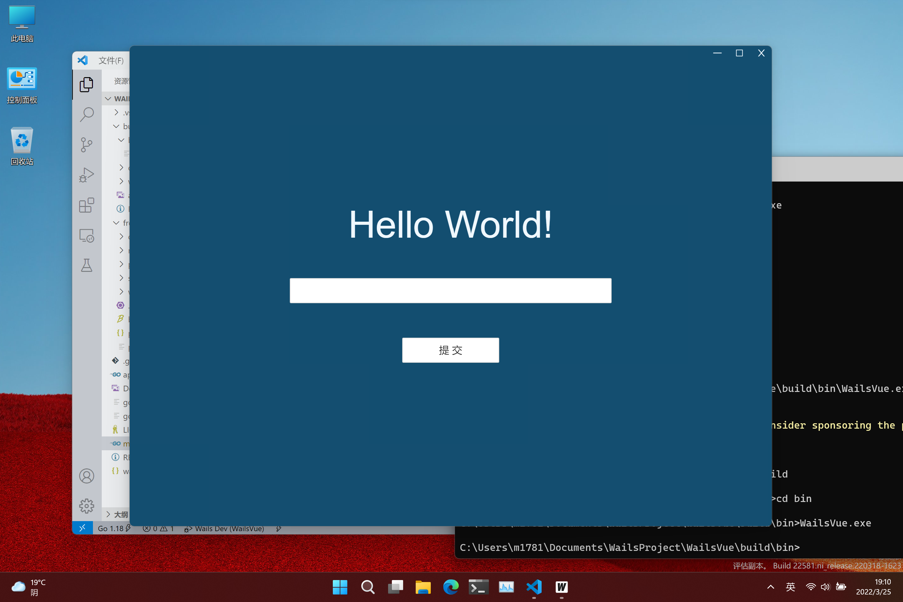

<h1 align="center">
    Wails-Vuejs3.x-template
</h1>
<p align="center">
  A Wails template based on Vue3.x
</p>
<p align="center">
    <a href="./LICENSE" >
        
    </a>
    
</p>

## Internationalization

English | [简体中文](./README-zh-cn.md)

## Graphic Demo



## Getting Started

### Preconditions
* golang && wails
* Vscode && plug-in f5anything
* nodejs && npm
* vue-cli && vue-cli-service
* git

### New Project
```
wails init -n [Your Appname] -t https://github.com/RockLakeGrass/wails-vue-js-3-template.git
```
If you are in China, you can use the `Gitee` to create your project
```
wails init -n [Your Appname] -t https://gitee.com/rocklakegrass/wails-vue-js-3-template.git
```

### VScode profile
This template comes with a `VSCode` configuration file and requires support from the `f5anything` plug-in.
The profile is discarded `dlv` for compatibility with `ARM64` and `x86 32bit`.

If you need your own profile, you can configure `.vscode/launch.json` yourself.

## Reference document
The front-end part uses `Vue` `Vue-cli` and `Ant Design Vue`:

* Vue: Use vue3.x version, please refer to the official [Vue3.x Documents](https://v3.vuejs.org/guide/introduction.html) for specific usage.
* Vue-cli: Use Vue-cli 3.x version, please refer to[Vue Cli 3.x Documents](https://cli.vuejs.org/zh/guide/installation.html).
* Ant Design Vue: Use the antd component library, please refer to[Ant Design Vue Documents](https://www.antdv.com/docs/vue/introduce-cn/).
* [Wails Vue3 template for Zero](https://gitee.com/zero_clown/wails-vue3-template)
Then you can refer to the official [Wails document](https://wails.top) to start developing your application.